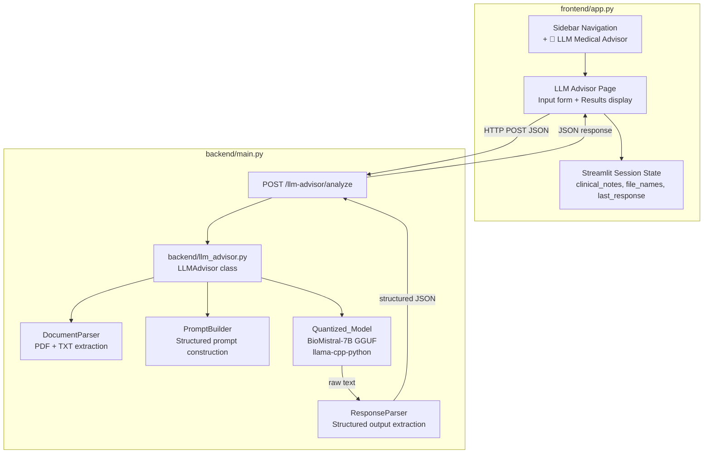

# Design Document: LLM Medical Advisor

## Overview

The LLM Medical Advisor adds a local, CPU-based clinical decision support page to the existing Smart Hospital Readmission Risk Analytics platform. A clinician provides free-text clinical notes and optionally uploads patient history and lab results documents; a quantized medical LLM processes these inputs and returns a structured recommendation covering admit decision, admission level, and follow-up tasks.

The feature integrates into the existing Streamlit frontend (`frontend/app.py`) and FastAPI backend (`backend/main.py`) without replacing or disrupting any existing functionality. All LLM inference runs locally — no external API calls are made.

### Research Summary

**Model selection:** [BioMistral-7B](https://huggingface.co/BioMistral/BioMistral-7B) (GGUF Q4_K_M, ~4.4 GB) is the primary recommendation. It is built on Mistral-7B and further pre-trained on PubMed Central, making it the best-fit open-source medical LLM at ≤7B parameters. [meditron-7B-GGUF](https://huggingface.co/TheBloke/meditron-7B-GGUF) (adapted from Llama-2-7B on medical corpora) is the fallback. Both are available in GGUF format and run on CPU via `llama-cpp-python`.

**Inference runtime:** [`llama-cpp-python`](https://github.com/abetlen/llama-cpp-python) provides Python bindings for `llama.cpp`, enabling CPU-only GGUF inference with no GPU dependency. Setting `n_gpu_layers=0` forces all computation to CPU.

**PDF parsing:** [`pypdf`](https://pypi.org/project/pypdf/) (the maintained successor to PyPDF2) handles text extraction from PDFs. It is pure-Python, has no system-level dependencies, and is compatible with Railway's build environment.

**RAM requirements:** A Q4_K_M quantized 7B model requires approximately 5–6 GB of RAM at runtime (4.4 GB model weight + ~1 GB for context and overhead). Railway's Hobby plan (8 GB RAM) is sufficient; the Starter plan (512 MB) is not.

---

## Architecture

The feature follows the existing two-tier architecture: a Streamlit frontend communicates with a FastAPI backend over HTTP. The LLM advisor adds one new backend module, one new frontend page, and one new API endpoint.



### Key Design Decisions

1. **Single FastAPI process**: The `/llm-advisor/analyze` endpoint is registered on the existing `app` instance in `backend/main.py` via an `APIRouter`. No additional Railway service or port is needed.

2. **Startup-time model loading with graceful degradation**: The `LLMAdvisor` class attempts to load the model at FastAPI startup using a `lifespan` event. If `LLM_MODEL_PATH` is unset or the file is absent, the advisor sets an internal `model_available = False` flag and the existing `/predict` and `/analytics` endpoints are unaffected.

3. **Module isolation**: All LLM-related logic lives in `backend/llm_advisor.py`. The existing `backend/main.py`, `backend/predictor.py`, and `backend/models.py` are modified minimally (router registration and new Pydantic models only).

4. **Session state in Streamlit**: The LLM advisor page uses `st.session_state` keys prefixed with `llm_advisor_` to avoid collisions with existing session state keys.

---

## Components and Interfaces

### 1. `backend/llm_advisor.py` — `LLMAdvisor`

Central orchestrator loaded once at startup.

```python
class LLMAdvisor:
    model: Optional[Llama]          # llama-cpp-python Llama instance
    model_available: bool           # False if model file absent or load failed
    model_path: str                 # resolved from LLM_MODEL_PATH env var
    context_window: int             # default 4096, read from model metadata

    def load_model(self) -> None: ...
    def analyze(
        self,
        clinical_notes: str,
        patient_history_text: Optional[str],
        lab_results_text: Optional[str],
    ) -> AnalysisResult: ...
```

### 2. `backend/llm_advisor.py` — `DocumentParser`

Stateless utility for extracting text from uploaded file bytes.

```python
class DocumentParser:
    MAX_FILE_BYTES: int = 10 * 1024 * 1024   # 10 MB
    MAX_TOKENS_PER_DOC: int = 3000

    @staticmethod
    def parse(file_bytes: bytes, filename: str) -> ParseResult: ...
    # ParseResult: { text: str, truncated: bool, error: Optional[str] }

    @staticmethod
    def _extract_pdf(file_bytes: bytes) -> str: ...

    @staticmethod
    def _extract_txt(file_bytes: bytes) -> str: ...

    @staticmethod
    def _truncate_to_tokens(text: str, max_tokens: int) -> tuple[str, bool]: ...
```

### 3. `backend/llm_advisor.py` — `PromptBuilder`

Constructs the structured clinical prompt from parsed inputs.

```python
class PromptBuilder:
    SYSTEM_INSTRUCTION: str   # constant system prompt defining the LLM's role

    @staticmethod
    def build(
        clinical_notes: str,
        patient_history: Optional[str],
        lab_results: Optional[str],
        context_window: int,
    ) -> str: ...
```

### 4. `backend/llm_advisor.py` — `ResponseParser`

Parses the LLM's raw text output into structured fields.

```python
class ResponseParser:
    VALID_ADMIT_DECISIONS: frozenset = frozenset({"Admit", "Do Not Admit", "Undetermined"})
    VALID_RECOMMENDATIONS: frozenset = frozenset({
        "Home Treatment", "Outpatient Care", "Inpatient Admission", "Undetermined"
    })

    @staticmethod
    def parse(raw_output: str) -> ParsedResponse: ...
    # ParsedResponse: {
    #   admit_decision: str,
    #   admission_recommendation: str,
    #   recommended_tasks: list[str],
    #   raw_output: Optional[str],   # populated when parsing fails
    # }
```

### 5. `backend/models.py` — New Pydantic Models

```python
class LLMAnalysisRequest(BaseModel):
    clinical_notes: str                          # required, non-empty
    patient_history_text: Optional[str] = None
    lab_results_text: Optional[str] = None

class LLMAnalysisResponse(BaseModel):
    admit_decision: str                          # "Admit" | "Do Not Admit" | "Undetermined"
    admission_recommendation: str               # "Home Treatment" | "Outpatient Care" | "Inpatient Admission" | "Undetermined"
    recommended_tasks: list[str]
    inputs_used: list[str]                       # e.g. ["clinical_notes", "patient_history"]
    truncation_occurred: bool
    raw_output: Optional[str] = None            # populated on parse failure
    error: Optional[str] = None                 # populated on inference error
```

### 6. `backend/main.py` — Router Registration

```python
from backend.llm_advisor import router as llm_advisor_router
app.include_router(llm_advisor_router, prefix="/llm-advisor")
```

The router exposes `POST /llm-advisor/analyze`.

### 7. `frontend/app.py` — Navigation Extension

The existing `option_menu` call for the main menu is extended to include `"🤖 LLM Medical Advisor"` as a third top-level item. When selected, the `page` variable is set to `"LLM Medical Advisor"` and the LLM advisor page function is called.

### 8. `frontend/llm_advisor_page.py` — LLM Advisor Page

A new module containing the Streamlit page rendering logic, keeping `frontend/app.py` clean.

```python
def render_llm_advisor_page(api_url: str) -> None:
    """Render the full LLM Medical Advisor page."""
    ...

def _render_input_form() -> tuple[str, Optional[bytes], Optional[str], Optional[bytes], Optional[str]]:
    """Render input widgets and return (notes, hist_bytes, hist_name, lab_bytes, lab_name)."""
    ...

def _render_results(response: dict) -> None:
    """Render structured recommendation output."""
    ...

def _call_analyze_endpoint(api_url: str, payload: dict) -> Optional[dict]:
    """POST to /llm-advisor/analyze and return parsed JSON or None on error."""
    ...
```

---

## Data Models

### Request Flow

```
Clinician Input
  ├── clinical_notes: str (text area, ≥1 char, ≤5000 chars displayed)
  ├── patient_history: UploadedFile? (PDF or TXT, ≤10 MB)
  └── lab_results: UploadedFile? (PDF or TXT, ≤10 MB)
        │
        ▼ Frontend validation
        │  - clinical_notes non-empty
        │  - file size ≤ 10 MB
        │  - file type in {pdf, txt}
        │
        ▼ Document parsing (frontend sends raw bytes to backend)
        │  DocumentParser.parse(bytes, filename)
        │  → { text: str, truncated: bool }
        │
        ▼ LLMAnalysisRequest (JSON body to /llm-advisor/analyze)
        │  { clinical_notes, patient_history_text?, lab_results_text? }
        │
        ▼ PromptBuilder.build(...)
        │  → structured prompt string
        │
        ▼ Llama.__call__(prompt)
        │  → raw_output: str
        │
        ▼ ResponseParser.parse(raw_output)
        │  → ParsedResponse
        │
        ▼ LLMAnalysisResponse (JSON)
           { admit_decision, admission_recommendation, recommended_tasks,
             inputs_used, truncation_occurred, raw_output? }
```

### Session State Keys

| Key | Type | Description |
|-----|------|-------------|
| `llm_advisor_clinical_notes` | `str` | Last entered clinical notes |
| `llm_advisor_history_filename` | `str \| None` | Name of last uploaded patient history file |
| `llm_advisor_lab_filename` | `str \| None` | Name of last uploaded lab results file |
| `llm_advisor_last_response` | `dict \| None` | Last `LLMAnalysisResponse` as dict |

### Prompt Template

```
[INST] <<SYS>>
You are a clinical decision support assistant. Your role is to analyze patient
information and provide a structured admission recommendation. You must respond
ONLY in the exact format specified below. Do not add explanations outside the
format. This output is for clinical decision support only and does not replace
professional medical judgment.
<</SYS>>

## Clinical Notes
{clinical_notes}

## Patient History
{patient_history_text | "Not provided."}

## Lab Results
{lab_results_text | "Not provided."}

Based on the above clinical information, provide your recommendation in EXACTLY
this format:

ADMIT DECISION: [Admit | Do Not Admit]
ADMISSION LEVEL: [Home Treatment | Outpatient Care | Inpatient Admission]
RECOMMENDED TASKS:
1. [task]
2. [task]
3. [task]
[INST]
```

### Response Parsing Rules

The `ResponseParser` uses regex patterns to extract fields from the raw LLM output:

- **Admit Decision**: matches `ADMIT DECISION:\s*(Admit|Do Not Admit)` (case-insensitive)
- **Admission Level**: matches `ADMISSION LEVEL:\s*(Home Treatment|Outpatient Care|Inpatient Admission)` (case-insensitive)
- **Recommended Tasks**: extracts numbered list items following `RECOMMENDED TASKS:`

If a field cannot be matched, it is set to `"Undetermined"` and `raw_output` is populated.

---

## Correctness Properties

*A property is a characteristic or behavior that should hold true across all valid executions of a system — essentially, a formal statement about what the system should do. Properties serve as the bridge between human-readable specifications and machine-verifiable correctness guarantees.*

### Property Reflection

Before listing properties, redundancy is eliminated:

- Properties 1.3 (session state round-trip) and 10.2 (navigate away/back) describe the same invariant — combined into **Property 1**.
- Properties 8.4 and 8.5 (normalization of Admit_Decision and Admission_Recommendation) are both output-normalization invariants — combined into **Property 8**.
- Properties 6.1, 6.2, 6.3, and 6.5 all test aspects of the prompt construction function for any inputs — combined into **Property 5** (prompt completeness).
- Properties 8.2 and 8.3 (fallback to "Undetermined") are both covered by the normalization property (Property 8) since "Undetermined" is the normalized fallback — merged.
- Properties 2.6 and 2.7 (file size and format validation) are both input validation properties — kept separate as they test different dimensions.

---

### Property 1: Session State Round-Trip

*For any* set of LLM advisor inputs (clinical notes, file names, last response) stored in session state, navigating away from the LLM Medical Advisor page and returning within the same session SHALL restore all stored fields to their original values.

**Validates: Requirements 1.3, 10.1, 10.2**

---

### Property 2: Clinical Notes Validation Rejects Blank Input

*For any* string composed entirely of whitespace characters (including the empty string), submitting it as `clinical_notes` to the `/llm-advisor/analyze` endpoint SHALL return HTTP 422 and SHALL NOT invoke the LLM model.

**Validates: Requirements 2.4, 4.6**

---

### Property 3: File Size Validation

*For any* uploaded file whose byte length exceeds 10,485,760 bytes (10 MB), the system SHALL reject the file with an error message and SHALL NOT pass its content to the document parser.

**Validates: Requirements 2.6**

---

### Property 4: File Format Validation

*For any* uploaded file whose extension is not in `{pdf, txt}`, the system SHALL reject the file with an error message listing accepted formats and SHALL NOT process the file.

**Validates: Requirements 2.7**

---

### Property 5: Prompt Completeness

*For any* combination of clinical notes (non-empty) and optional patient history and lab results texts, the prompt constructed by `PromptBuilder.build()` SHALL:
- contain the system instruction defining the LLM's clinical role,
- contain a clearly labeled section for each input (with a placeholder note for any absent optional input),
- contain the structured output format instruction specifying all three output sections,
- have a total token count that does not exceed the model's configured context window.

**Validates: Requirements 6.1, 6.2, 6.3, 6.4, 6.5**

---

### Property 6: Document Text Round-Trip

*For any* valid plain-text string, the sequence `DocumentParser._extract_txt(encode_as_utf8_bytes(text))` → `format_for_prompt(text)` → `DocumentParser._extract_txt(encode_as_utf8_bytes(formatted))` SHALL produce text content equivalent to the original (modulo leading/trailing whitespace normalization).

**Validates: Requirements 3.2, 3.6**

---

### Property 7: Token Truncation Invariant

*For any* document text string, after applying `DocumentParser._truncate_to_tokens(text, 3000)`:
- the resulting token count SHALL be ≤ 3,000,
- the `truncated` flag SHALL be `True` if and only if the original text exceeded 3,000 tokens.

**Validates: Requirements 3.4**

---

### Property 8: Response Normalization Invariant

*For any* raw LLM output string, `ResponseParser.parse(raw_output)` SHALL produce a result where:
- `admit_decision` is always a member of `{"Admit", "Do Not Admit", "Undetermined"}`,
- `admission_recommendation` is always a member of `{"Home Treatment", "Outpatient Care", "Inpatient Admission", "Undetermined"}`.

**Validates: Requirements 8.2, 8.3, 8.4, 8.5**

---

### Property 9: Response Parsing Round-Trip

*For any* valid structured LLM output string (one that contains all three required sections in the expected format), the sequence `ResponseParser.parse(raw)` → `format_as_structured_text(parsed)` → `ResponseParser.parse(reformatted)` SHALL produce a result equivalent to the first parse.

**Validates: Requirements 8.6**

---

### Property 10: Structured Response Always Contains Required Fields

*For any* valid `LLMAnalysisRequest` (non-empty clinical notes), the `/llm-advisor/analyze` endpoint SHALL return a response body that always contains `admit_decision`, `admission_recommendation`, and `recommended_tasks` fields, regardless of the LLM's raw output content.

**Validates: Requirements 4.2**

---

### Property 11: Graceful Degradation Preserves Existing Endpoints

*For any* request to `/predict` or `/analytics` when `LLM_MODEL_PATH` is unset or the model file is absent, the response SHALL be a successful HTTP 200 response (not 503 or any other error caused by the absent LLM model).

**Validates: Requirements 9.3**

---

### Property 12: Clear Resets All Session State

*For any* non-empty LLM advisor session state (any combination of stored clinical notes, file names, and last response), activating the "Clear" button SHALL result in all four `llm_advisor_*` session state keys being set to their initial empty/None values.

**Validates: Requirements 10.3, 10.4**

---

## Error Handling

### Model Unavailable (HTTP 503)

When `LLMAdvisor.model_available` is `False` (model file absent, `LLM_MODEL_PATH` unset, or load failure), the `/llm-advisor/analyze` endpoint returns:

```json
{
  "detail": "LLM model is not available. Set LLM_MODEL_PATH to a valid GGUF model file and restart the service."
}
```

The frontend displays a configuration notice with instructions for setting `LLM_MODEL_PATH`.

### Inference Timeout (HTTP 504)

A `asyncio.wait_for` wrapper with a 60-second timeout surrounds the `llama-cpp-python` call. On timeout:

```json
{
  "detail": "LLM inference timed out after 60 seconds. The model may be overloaded or the input too long."
}
```

### PDF Parse Failure

If `pypdf` raises `PdfReadError` (encrypted, corrupted, or non-PDF bytes), `DocumentParser.parse()` returns a `ParseResult` with `error` set to a descriptive message. The backend includes this in `LLMAnalysisResponse.error` and the frontend displays it inline.

### File Validation Errors (Frontend)

File size and format validation happens in the Streamlit frontend before any HTTP call is made. Errors are displayed using `st.error()` inline with the upload widget.

### Partial Parse Failure

If `ResponseParser` cannot extract one or more fields, those fields are set to `"Undetermined"` and `raw_output` is populated in the response. The frontend displays the undetermined fields with a warning and shows the raw output in an expandable section for clinical review.

### Backend Unreachable

If the HTTP call from the frontend to `/llm-advisor/analyze` fails (connection error, timeout), the frontend displays a user-friendly error message and a "Retry" button. The existing `/predict` and `/analytics` fallback logic is unaffected.

---

## Testing Strategy

### Unit Tests

Unit tests cover pure logic components with no external dependencies:

- `DocumentParser._extract_txt`: verify UTF-8 round-trip for ASCII, Unicode, and multi-line strings.
- `DocumentParser._truncate_to_tokens`: verify token count invariant and truncation flag.
- `PromptBuilder.build`: verify prompt completeness for all combinations of present/absent optional inputs.
- `ResponseParser.parse`: verify normalization invariant, round-trip property, and fallback to "Undetermined" for malformed inputs.
- Session state management: verify Clear resets all keys, verify navigation round-trip preserves state.
- File validation: verify size and format rejection logic.

### Property-Based Tests

Property-based testing is appropriate for this feature because the core logic components (`DocumentParser`, `PromptBuilder`, `ResponseParser`) are pure functions with clear input/output behavior and large input spaces where edge cases matter (Unicode text, malformed LLM output, varying document lengths).

**Library:** [`hypothesis`](https://hypothesis.readthedocs.io/) (Python property-based testing library).

**Configuration:** Each property test runs a minimum of 100 iterations (`@settings(max_examples=100)`).

**Tag format:** Each test is tagged with a comment: `# Feature: llm-medical-advisor, Property N: <property_text>`

Property tests to implement:

| Property | Test Description |
|----------|-----------------|
| Property 1 | Generate random session state dicts; verify round-trip through navigation simulation |
| Property 2 | Generate whitespace-only strings; verify 422 response and no model call |
| Property 3 | Generate file sizes above and below 10 MB threshold; verify rejection/acceptance |
| Property 4 | Generate random file extensions; verify only `{pdf, txt}` are accepted |
| Property 5 | Generate random note/history/lab combinations; verify prompt contains all required sections and fits context window |
| Property 6 | Generate random UTF-8 strings; verify text round-trip through parse → format → parse |
| Property 7 | Generate random text strings; verify truncation invariant |
| Property 8 | Generate random strings as LLM output; verify normalization invariant |
| Property 9 | Generate valid structured LLM outputs; verify parse round-trip |
| Property 10 | Generate valid requests with mocked LLM; verify response always contains required fields |
| Property 11 | Simulate absent model; verify /predict and /analytics return 200 |
| Property 12 | Generate random non-empty session states; verify Clear resets all keys |

### Integration Tests

Integration tests run against the full FastAPI application with the LLM model mocked:

- `POST /llm-advisor/analyze` with valid payload returns 200 and correct schema.
- `POST /llm-advisor/analyze` with blank `clinical_notes` returns 422.
- `POST /llm-advisor/analyze` when model unavailable returns 503.
- `GET /health`, `POST /predict`, `GET /analytics` all return 200 when model is absent.

### Smoke Tests

- Verify `LLM_MODEL_PATH` environment variable is read correctly.
- Verify `n_gpu_layers=0` is set in model configuration (CPU-only).
- Verify startup log contains model name, file size, and load time when model is present.
